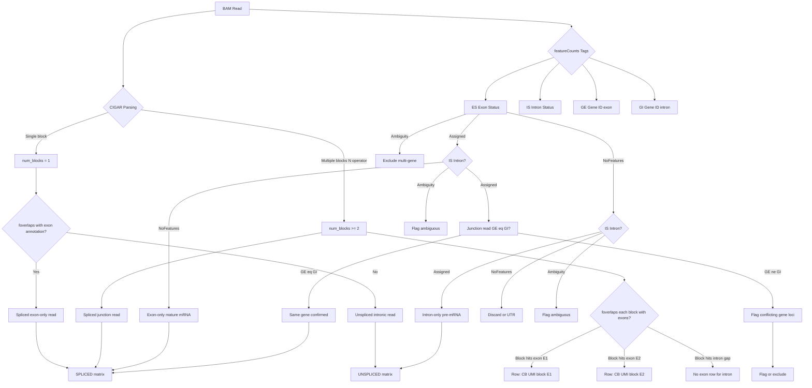
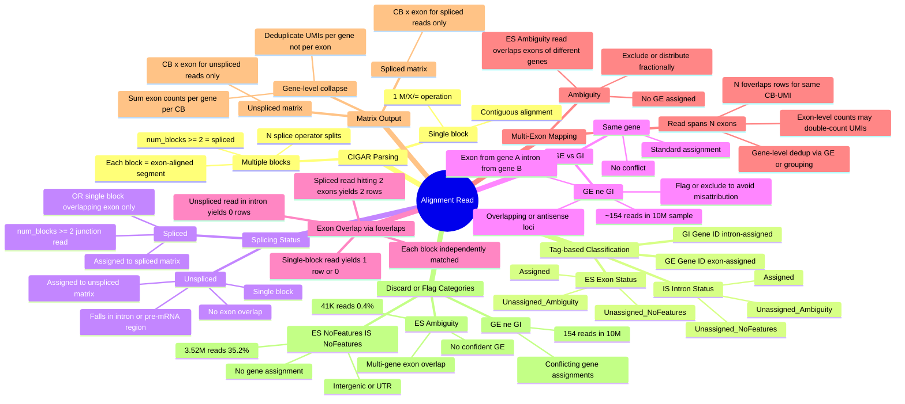

# Read Classification Logic

How each alignment read is processed from BAM through to spliced/unspliced matrix assignment.

## CIGAR-Based Classification

## Read Classification Mindmap

## ES x IS Cross-tabulation (chr1, first 10M reads)

| ES ↓ / IS → | Assigned3 | NoFeatures | Ambiguity | Total |
|---|---|---|---|---|
| **Assigned3** | 332,049 | 5,754,106 | — | 6,086,155 |
| **NoFeatures** | 351,316 | 3,521,114 | 16 | 3,872,446 |
| **Ambiguity** | 60 | 41,329 | — | 41,389 |

### Read categories

- **5.75M (57.5%)** ES=Assigned / IS=NoFeatures → exon-only reads (mature mRNA, no intron overlap)
- **3.52M (35.2%)** ES=NoFeatures / IS=NoFeatures → intergenic/UTR/unannotated (outside GTF features)
- **351K (3.5%)** ES=NoFeatures / IS=Assigned → intron-only reads (pre-mRNA/nascent transcripts with GI but no GE)
- **332K (3.3%)** ES=Assigned / IS=Assigned → exon-intron spanning reads (spliced junction reads; both GE and GI populated — key for RNA velocity)
- **41K** ES=Ambiguity / IS=NoFeatures → reads overlapping exons of multiple genes, no intron overlap to disambiguate
- **154 reads** in first 500K of chr19 had GE ≠ GI → reads bridging exons of one gene and introns of another (overlapping/antisense gene loci)

### Biological interpretation

- Exon-only reads = high-confidence mature mRNA expression
- Intron-only reads = transcriptional activity but not spliced; nuclear/pre-mRNA signal
- Exon-intron spanning = junction reads confirming splicing; most informative for isoform resolution and RNA velocity (spliced vs unspliced)
- GE ≠ GI reads = intergenic splicing ambiguity or overlapping gene architectures; should be flagged/excluded to avoid misattribution